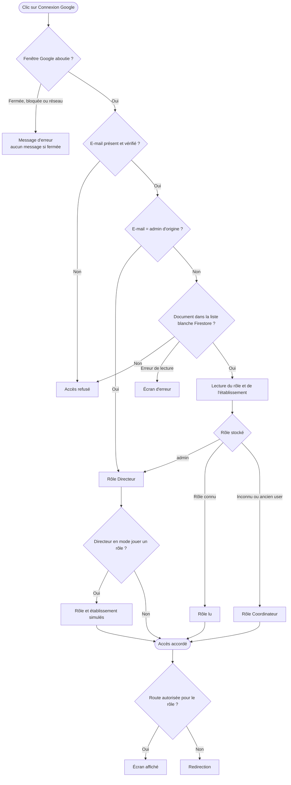
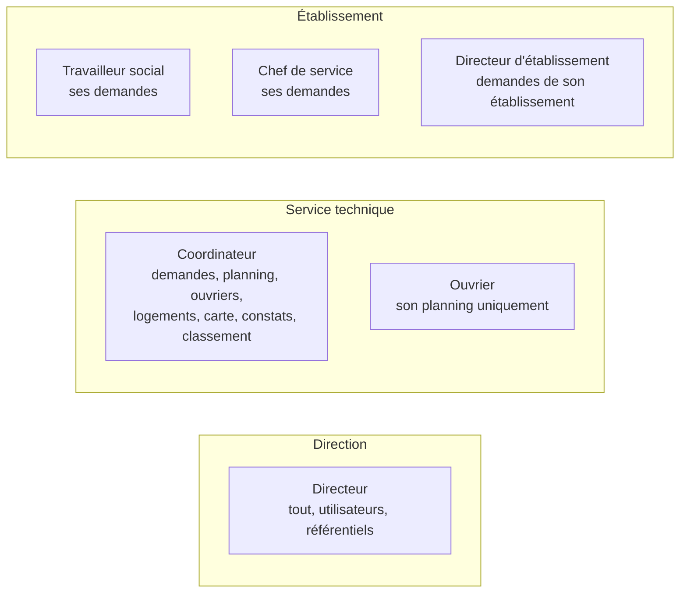

# 1. Connexion, liste blanche et droits

Sources : `store/providers/AuthProvider.tsx`, `store/queries/users.ts`, `helpers/roles.ts`.

```mermaid
flowchart TD
    A([Clic sur Connexion Google]) --> B{Fenêtre Google aboutie ?}
    B -- "Fermée, bloquée ou réseau" --> B1[Message d'erreur<br/>aucun message si fermée]
    B -- Oui --> C{E-mail présent et vérifié ?}
    C -- Non --> X[Accès refusé]
    C -- Oui --> D{E-mail = admin d'origine ?}
    D -- Oui --> R1[Rôle Directeur]
    D -- Non --> E{Document dans la liste blanche Firestore ?}
    E -- Non --> X
    E -- "Erreur de lecture" --> ERR[Écran d'erreur]
    E -- Oui --> F[Lecture du rôle et de l'établissement]
    F --> G{Rôle stocké}
    G -- "admin" --> R1
    G -- "Rôle connu" --> R2[Rôle lu]
    G -- "Inconnu ou ancien user" --> R3[Rôle Coordinateur]
    R1 --> H{Directeur en mode jouer un rôle ?}
    H -- Oui --> R4[Rôle et établissement simulés]
    H -- Non --> OK
    R2 --> OK
    R3 --> OK
    R4 --> OK
    OK([Accès accordé]) --> S{Route autorisée pour le rôle ?}
    S -- Oui --> P[Écran affiché]
    S -- Non --> Q[Redirection]
```

## Droits par rôle

```mermaid
flowchart LR
    subgraph Direction
      D[Directeur<br/>tout, utilisateurs, référentiels]
    end
    subgraph Service technique
      C[Coordinateur<br/>demandes, planning, ouvriers,<br/>logements, carte, constats, classement]
      O[Ouvrier<br/>son planning uniquement]
    end
    subgraph Établissement
      T[Travailleur social<br/>ses demandes]
      CS[Chef de service<br/>ses demandes]
      DE[Directeur d'établissement<br/>demandes de son établissement]
    end
```
